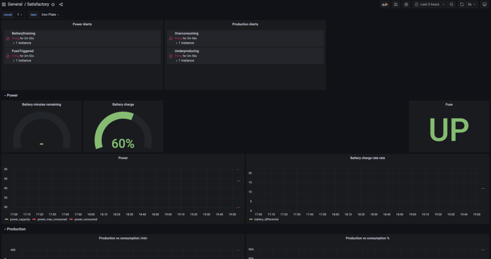
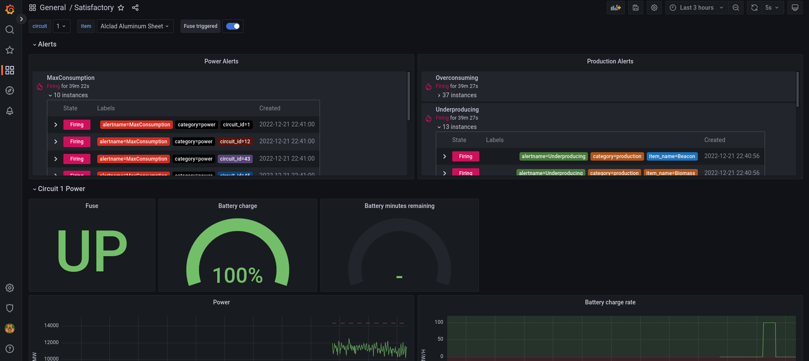
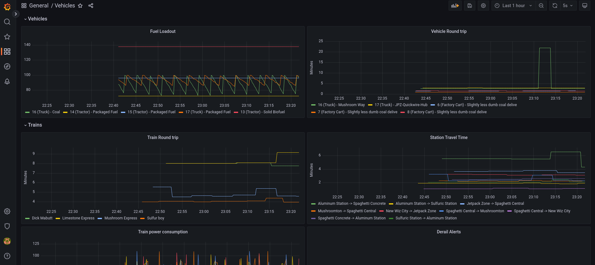
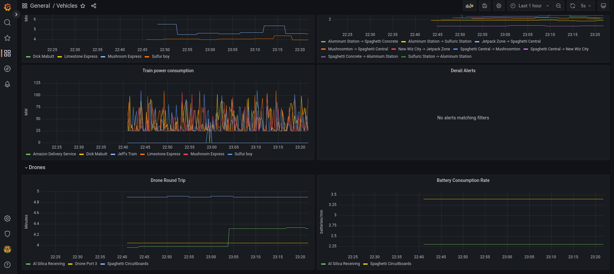

# Ficsit Remote Monitoring Companion Bundle

A docker-compose for getting Satisfactory dashboards and alerting. Configured to view dashboards and alerts including:

### General production and power stats


Power grid overview and Production vs Consumption levels.


Power and production alerts are also displayed.

### Discord alerts


Discord alerting for tripped grids.

### Vehicle dashboard overview


Get an overview of your vehicle, train, and drone infrastructure.

View vehicles real-time round trip times and fuel.

View Trains round trip times and travel times between stations.



View drone battery usage and round trip times.

Docker compose setup for Ficsit Remote Monitoring and alerting. Requires [FicsitRemoteMonitoring](https://ficsit.app/mod/FicsitRemoteMonitoring) plugin.
With FicsitRemoteMonitoring plugin, make sure you boot the http server `/frmweb start` in game or autostart the webserver.

## Env Vars

- `FRM_HOST` - Host where the Ficsit Remote Monitoring webserver is running. Generally this is your computer's IP address, EG: `192.168.1.20`. (Default: `fakeserver`)
- `FRM_PORT` - Port where the Ficsit Remote Monitoring webserver is running. `8080` is FRM's default at the time of writing. (Default: `8080`)
- `DISCORD_WEBHOOK` - Webhook for discord fuse and low battery notifications. Something like `https://discord.com/api/webhooks/12345/abcd12345`.

## Services and ports

- [grafana](http://localhost:3000): Time series graphing dashboard. Default username/password is `admin/admin`. This is the main front end for the app.
- [frmcompanion](http://localhost:9000/metrics): A webapp that converts JSON data from FRM into Prometheus metrics at `localhost:9000/metrics`. There is also a realtime map app. `localhost:8000?frmhost=localhost&frmport=8080`.
- [prometheus](http://localhost:9090): Ingest metrics from the remote monitoring companion. Generates alert metrics for interesting anomalies.
- [alertmanager](http://localhost:9093): Forwards critical alerts to notification components.
- alertmanager-discord: Sends critical alerts to Discord.
- frmcache: a caching server that pushes json metrics to a running postgres container
- postgres - the database server that frm cache pushes to, and acts as an additional data source for grafana.
- fakeserver: Test server for fake metrics used for testing. Maps to host port 8082 to avoid port conflicts if FRM is running on localhost.
  - [getFactory](http://localhost:8082/getFactory)
  - [getPower](http://localhost:8082/getPower)
  - [getProdStats](http://localhost:8082/getProdStats)
  - [getTrains](http://localhost:8082/getTrains)

## Getting started

### Installing and configuring the mod

Install the [ficsit remote monitoring](https://ficsit.app/mod/FicsitRemoteMonitoring) mod with the [Satisfactory Mod Manager](https://smm.ficsit.app/)[^1].

[^1]: Mods are currently unavailable on dedicated servers.

Edit the web server config -- on steam this is something like `C:\\Program Files (x86)\Steam\steamapps\common\Satisfactory\FactoryGame\Configs\FicsitRemoteMonitoring\WebServer.cfg`

We are interested in two settings:
`Listen_IP`: the address to listen for requests. This is by default localhost which will not allow external IPs. If you're running the monitoring stack on a different computer, you may need to set this to `0.0.0.0` to allow the monitoring computer access to the factory data.
`Web_Autostart`: set to true to autostart the webserver when we load the game.

An example configuration can look like the following:
```
{
  "Listen_IP": "127.0.0.1",
  "HTTP_Port": 8080,
  "Web_Autostart": true,
  "Web_Root": "",
  "SML_ModVersion_DoNotChange": "0.8.30"
}
```

### Installing docker-compose

Follow a [docker engine install guide](https://docs.docker.com/engine/install/). At the end of it, running `docker compose` from a command line or terminal should print out help options for [docker-compose](https://docs.docker.com/compose/).

#### Windows docker troubleshooting

[Consult the following docker topics for troubleshooting](https://docs.docker.com/desktop/troubleshoot/topics/#virtualization). TLDR, you need virtualization enabled in your bios, and windows features for WSL/Hyper-V.

### Setup environment

Download the project files, either [cloned through git](https://github.com/featheredtoast/satisfactory-monitoring.git), or [Download the zip](https://github.com/featheredtoast/satisfactory-monitoring/archive/refs/heads/main.zip) and extract it.

#### Optional: Discord alerts

You can set up a webhook for Discord by creating a webhook [following the guide](https://support.discord.com/hc/en-us/articles/228383668-Intro-to-Webhooks). Save the webhook link. It will look something like `https://discord.com/api/webhooks/12345/abcd12345`.

### Optional: running monitoring on a separate computer

If running the monitoring app on a separate computer, find the IP address for the computer running Satisfactory eg, in windows running `ipconfig` in command line and note the IPv4 address, it will look something like `192.168.1.30`.

Ensure that the `Listen_IP` is set to `0.0.0.0` in the mod's `WebServer.cfg`.

#### Server configuration

Create an [.env file](https://docs.docker.com/compose/environment-variables/set-environment-variables/) in the `satisfactory-monitoring` directory. We will store our configuration in here.

Add the saved data (IP address and webhook, if desired) to the .env file. It will look something like the following:
```
FRM_HOST=192.168.1.30
DISCORD_WEBHOOK=https://discord.com/api/webhooks/12345/abcd12345
```

You may omit the FRM_HOST if you're running the monitoring on the same computer as Satisfactory.
You may omit the DISCORD_WEBHOOK if you are not using discord for alerts.
You do not need the `.env` file if you do not need either of these.

Start satisfactory, and run `docker compose up -d` from the `satisfactory-monitoring` directory.

Navigate to `localhost:3000`. Log in with username: admin, password: admin. You should now be able to see the dashboards. Use the navigation on the left side to view available dashboards.

### Remove environment

When you're done with the data, you can run `docker compose down` which will completely delete and remove the monitoring stack.
